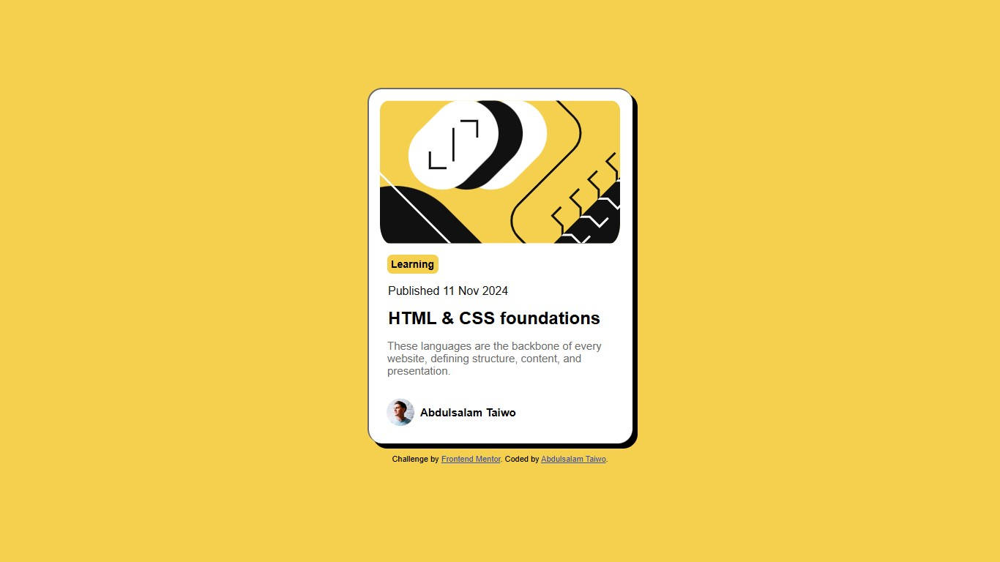

# Frontend Mentor - Blog preview card

## Welcome! 👋

Thanks for checking out this front-end coding challenge.

### Links

- Solution URL:(https//github.com/Symplyteeziy/blogcard)
- Live Site URL: (https://blogcard-murex.vercel.app)

### Built with

- Semantic HTML5 markup
- CSS custom properties
- Flexbox
- CSS Grid
- For styles

### What I learned

I lernt how to add effect to a border.

## Author

- Frontend Mentor - [@Symplyteeziy](https://www.frontendmentor.io/profile/Symplyteeziy)
- Twitter - [@iamsymplyteeziy](https://www.twitter.com/iamsymplyteeziy)

## Acknowledgments
I want to thanks the frontend member for always ready to help.
[Frontend Mentor](https://www.frontendmentor.io) challenges help you improve your coding skills by building realistic projects.

## Thank you 👋
